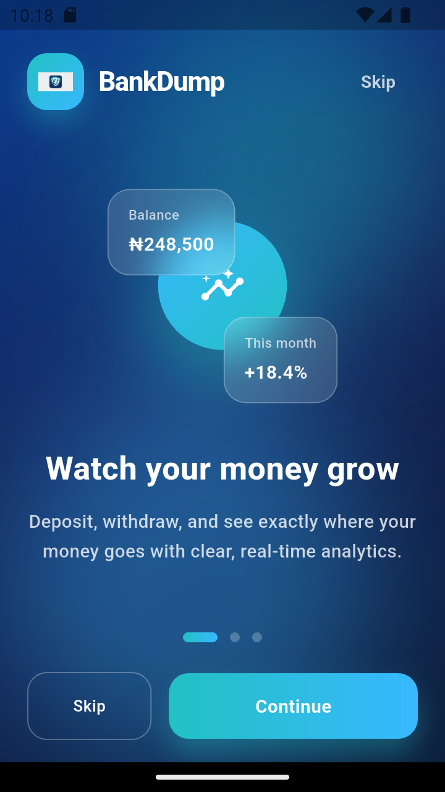
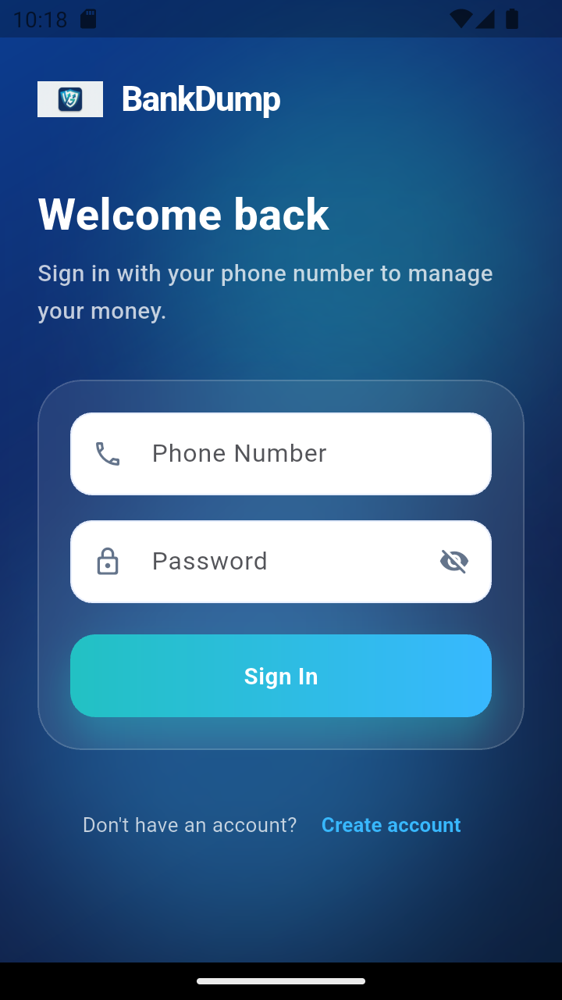
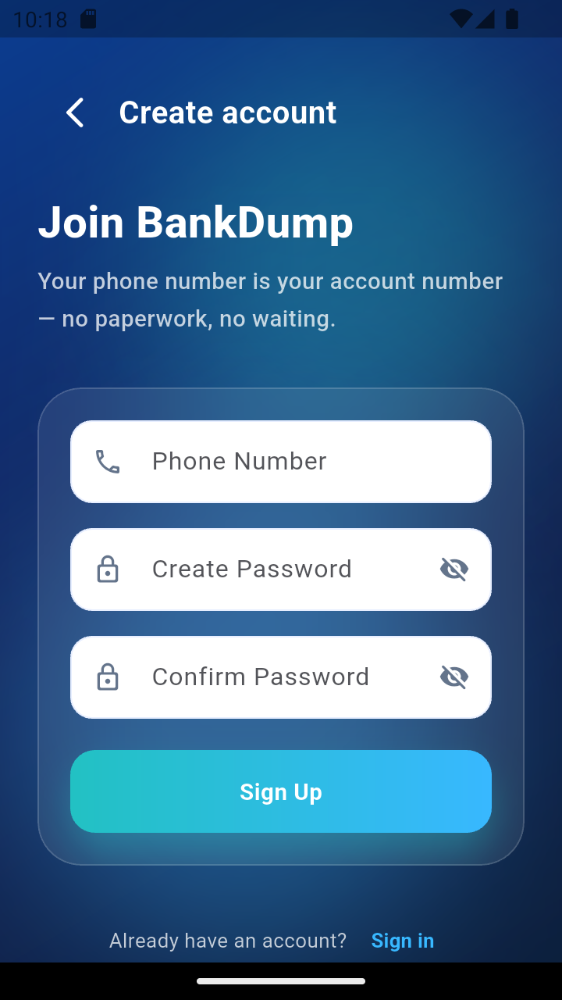
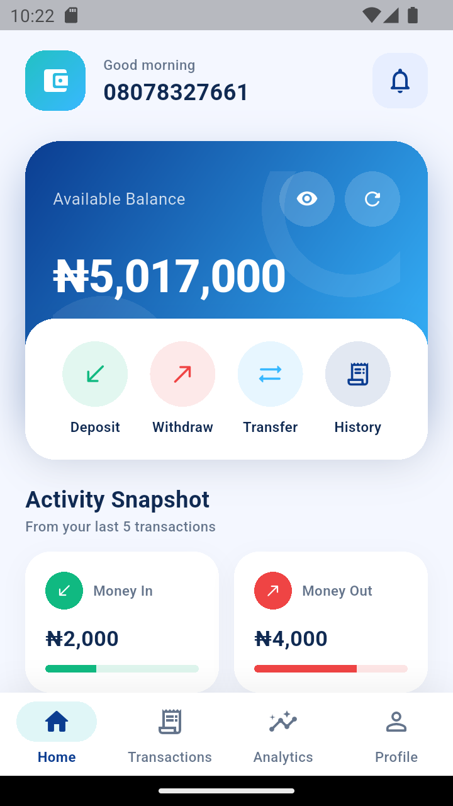
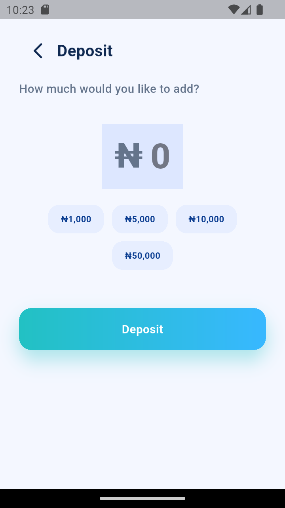
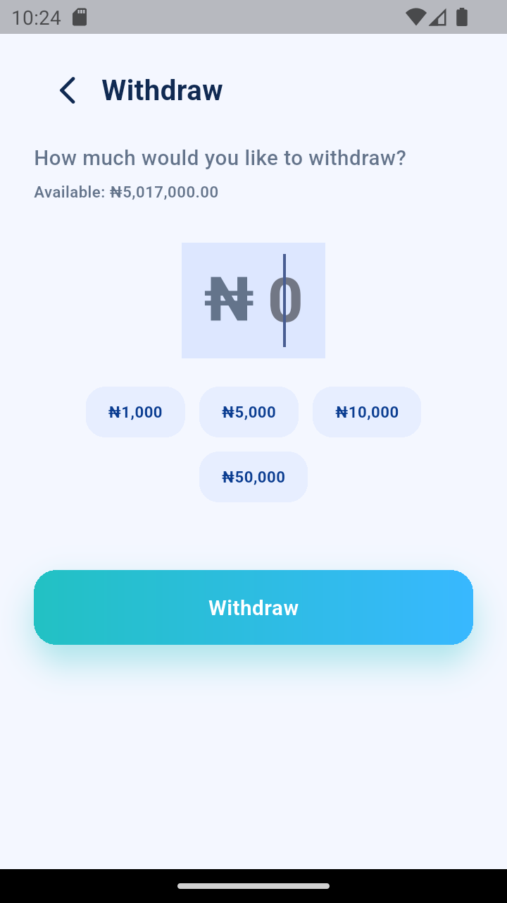
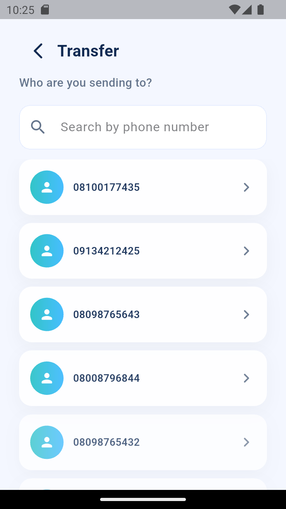
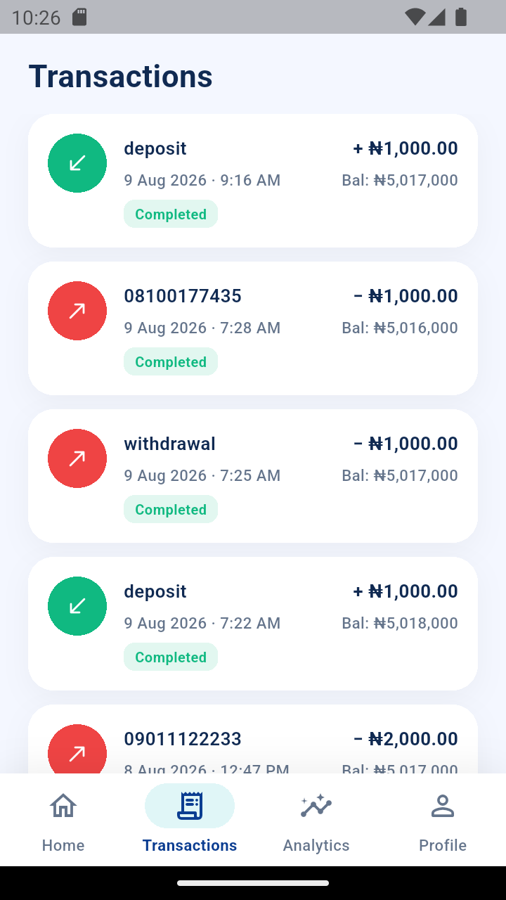
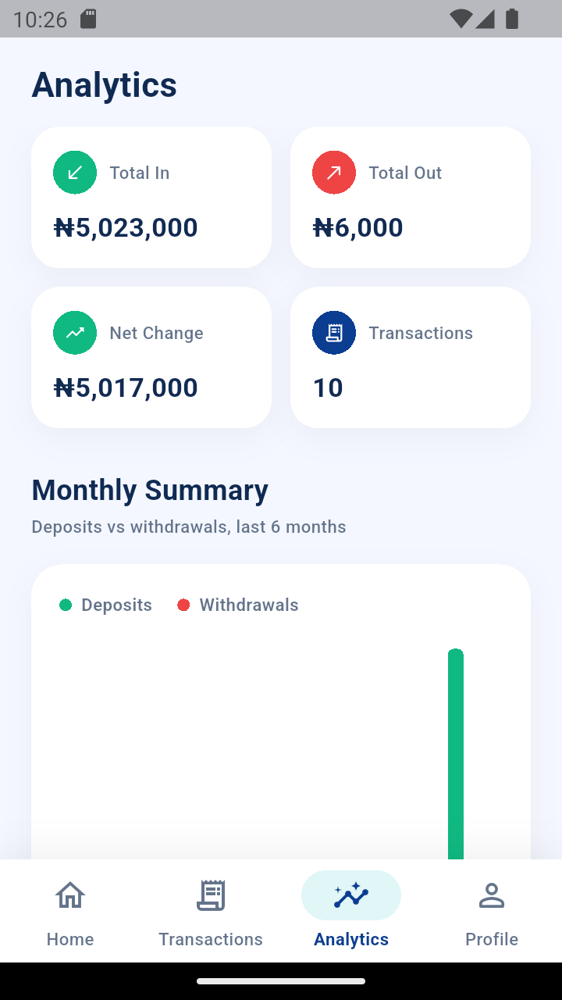
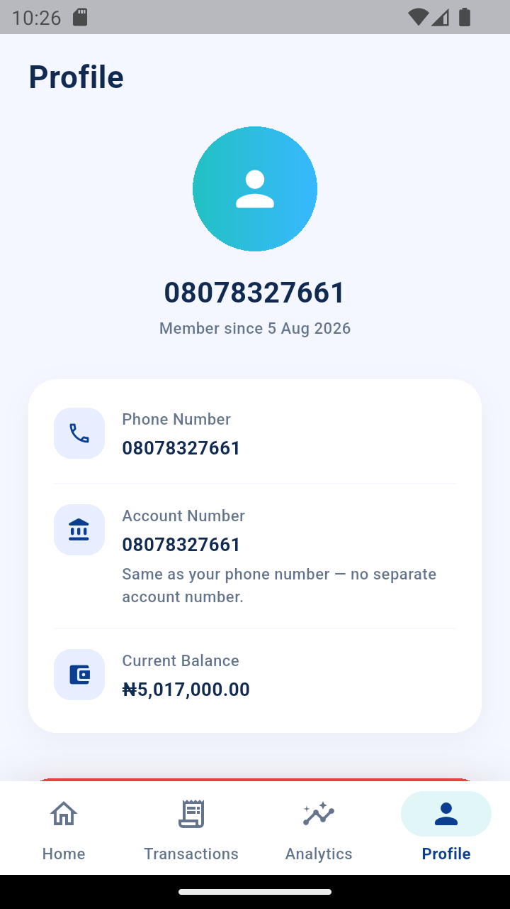

# bank_dump

A Flutter mobile banking client built against the Veegil banking API.

## Submission APK

The signed release build for this submission is at [`submission/BankDump-OwolabiTemitopeAzeez-v1.0.0.apk`](submission/BankDump-OwolabiTemitopeAzeez-v1.0.0.apk).

## Screenshots

Captured live off the running app (`dev` flavor, Android emulator) — full-size images are in [`screenshots/`](screenshots/).

<table>
<tr>
<td align="center"><br>Onboarding</td>
<td align="center"><br>Login</td>
<td align="center"><br>Signup</td>
<td align="center"><br>Dashboard</td>
<td align="center"><br>Deposit</td>
</tr>
<tr>
<td align="center"><br>Withdraw</td>
<td align="center"><br>Transfer</td>
<td align="center"><br>Transactions</td>
<td align="center"><br>Analytics</td>
<td align="center"><br>Profile</td>
</tr>
</table>

## Candidate

**Owolabi Temitope Azeez** — submission for the Mobile Developer role at Veegil Technologies.

### Work summary

Built a full banking client against the Veegil API — auth, money movement, transaction history, and account management.

- **Auth** — login/signup on the real `phoneNumber` + `password` contract (the phone number is the account number, there's no name or email field on the API), JWT saved to secure storage, session restored on app restart, logout.
- **Dashboard** — balance card with show/hide and pull-to-refresh, quick actions, recent transactions, and a stats preview.
- **Deposit / Withdraw / Transfer** — preset and custom amounts, validation, confirmation, success/failure states, and idempotency keys on all three so retries are safe.
- **Transactions** — paginated history with type, amount, date/time, balance after, and counterparty.
- **Analytics** — deposits vs. withdrawals rolled up into monthly and weekly charts, computed on the client since the API doesn't expose analytics.
- **Profile** — account details and logout.
- Network/timeout/offline/401 handling with retry, loading/empty/error states on every screen, and skeleton loaders while data comes in.

Clean Architecture (`domain`/`data`/`presentation` per feature), Riverpod for state, three build flavors (`dev`/`staging`/`prod`), and it passes `flutter analyze` and `flutter test`.

## Prerequisites

- Flutter SDK (stable channel)
- A configured Android/iOS toolchain (Android Studio / Xcode) or a running emulator/simulator/device

## Development environment

Built and tested on:

|                      |                                                                                |
| -------------------- | ------------------------------------------------------------------------------ |
| Flutter              | 3.38.4 (stable channel)                                                        |
| Dart                 | 3.10.3                                                                         |
| OS                   | macOS 15.7.7 (darwin-x64)                                                      |
| Android toolchain    | Android SDK 35.0.0, platform android-36, build-tools 35.0.0, licenses accepted |
| Java                 | OpenJDK 17.0.11 (bundled with Android Studio)                                  |
| iOS toolchain        | Xcode 26.3, CocoaPods 1.16.2                                                   |
| Web                  | Chrome 151.0.7922.77                                                           |
| Devices exercised on | Android emulator (API 33 / Android 13), macOS desktop, Chrome                  |

## Flavors

The app ships three flavors, each with its own entrypoint:

| Flavor  | Entrypoint              |
| ------- | ----------------------- |
| dev     | `lib/main_dev.dart`     |
| staging | `lib/main_staging.dart` |
| prod    | `lib/main_prod.dart`    |

`lib/main.dart` is the default entrypoint and forwards to `main_prod.dart`.

## Running the app

A `Makefile` at the repo root wraps the flavor-specific `flutter run`/`flutter build` invocations. From the project root:

```sh
make run-dev      # flutter run --flavor dev -t lib/main_dev.dart
make run-staging  # flutter run --flavor staging -t lib/main_staging.dart
make run-prod     # flutter run --flavor prod -t lib/main_prod.dart
```

iOS-specific targets (`run-ios-dev`, `run-ios-staging`, `run-ios-prod`) are also available and currently equivalent to their non-iOS counterparts.

## Testing & analysis

```sh
make analyze   # flutter analyze
make test      # flutter test
```

## Building release artifacts

```sh
make apk-dev      # flutter build apk --release --flavor dev -t lib/main_dev.dart
make apk-staging  # flutter build apk --release --flavor staging -t lib/main_staging.dart
make apk-prod     # flutter build apk --release --flavor prod -t lib/main_prod.dart

make bundle-dev      # flutter build appbundle --release --flavor dev -t lib/main_dev.dart
make bundle-staging  # flutter build appbundle --release --flavor staging -t lib/main_staging.dart
make bundle-prod     # flutter build appbundle --release --flavor prod -t lib/main_prod.dart

make ios-dev      # flutter build ios --release --flavor dev -t lib/main_dev.dart --no-codesign
make ios-staging  # flutter build ios --release --flavor staging -t lib/main_staging.dart --no-codesign
make ios-prod     # flutter build ios --release --flavor prod -t lib/main_prod.dart --no-codesign
```

Built APKs land under `build/app/outputs/flutter-apk/`.

## Architecture

Clean Architecture, feature-based, under `lib/features/<feature>/{domain,data,presentation}`, with shared plumbing (networking, DI, routing, storage, theming) under `lib/core/`. State management is Riverpod only.

## API

Consumes the hosted banking API at `https://bankapi.veegil.com/api/v1` (OpenAPI spec at `https://bankapi.veegil.com/openapi.json`). See `API_RULES.md` for the integration rules.
